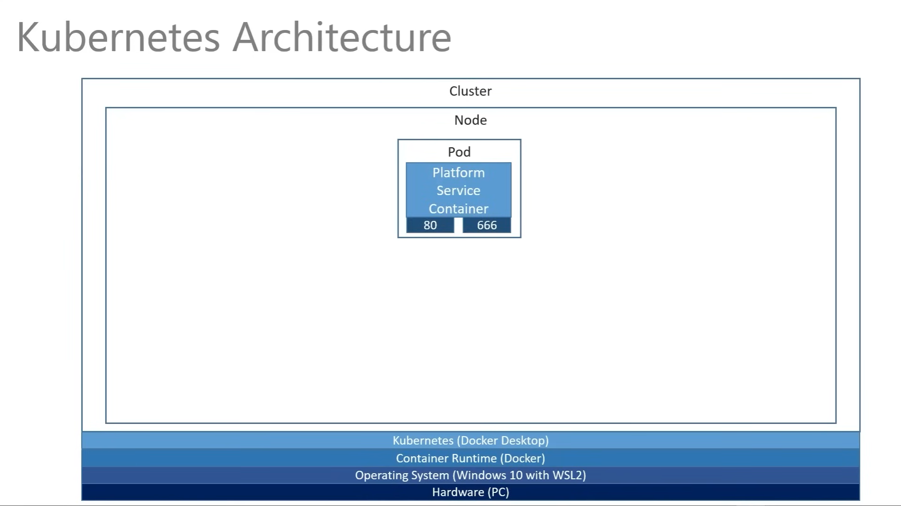
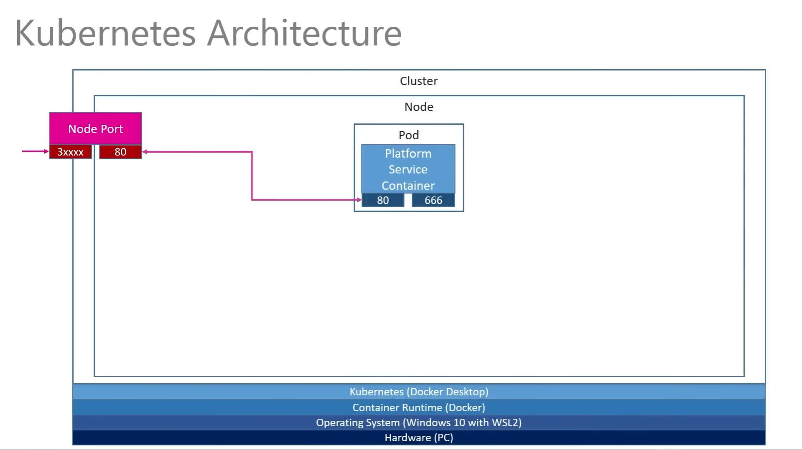
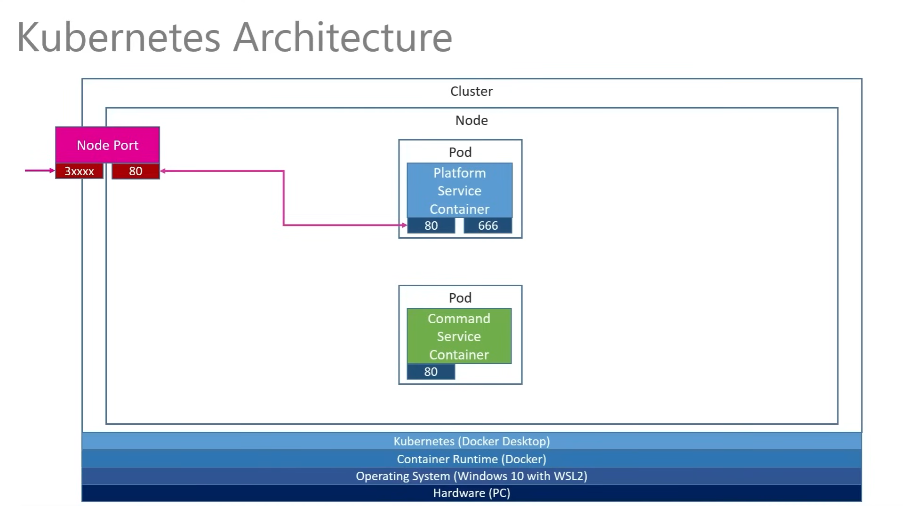
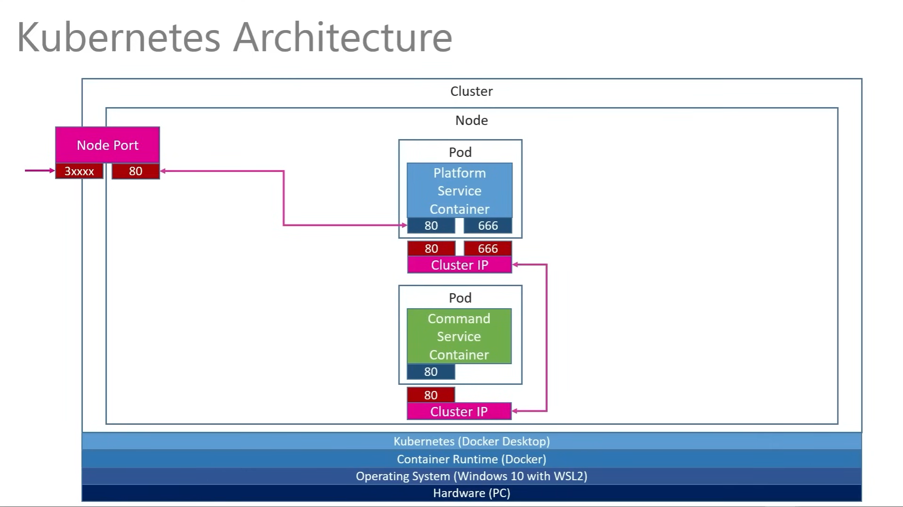
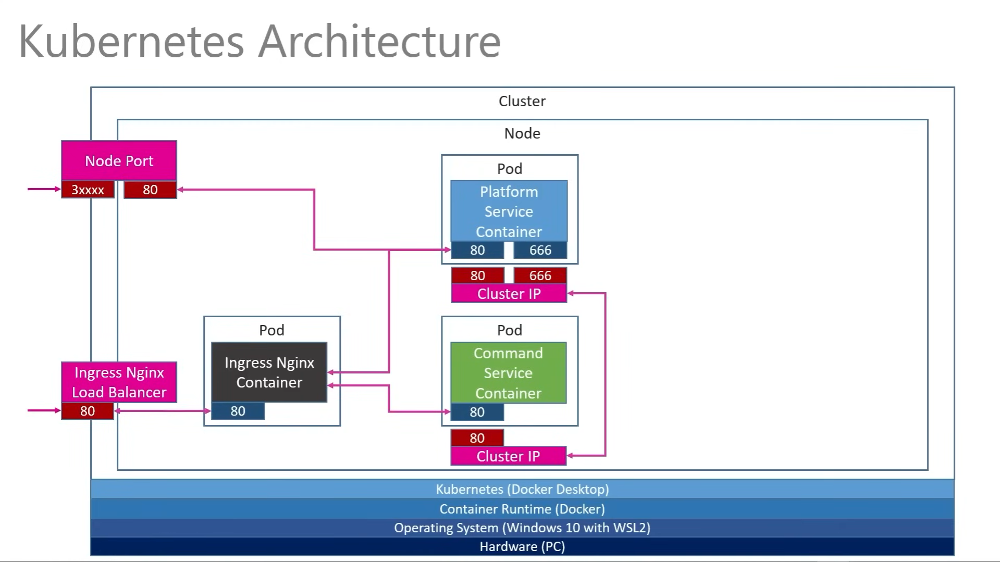
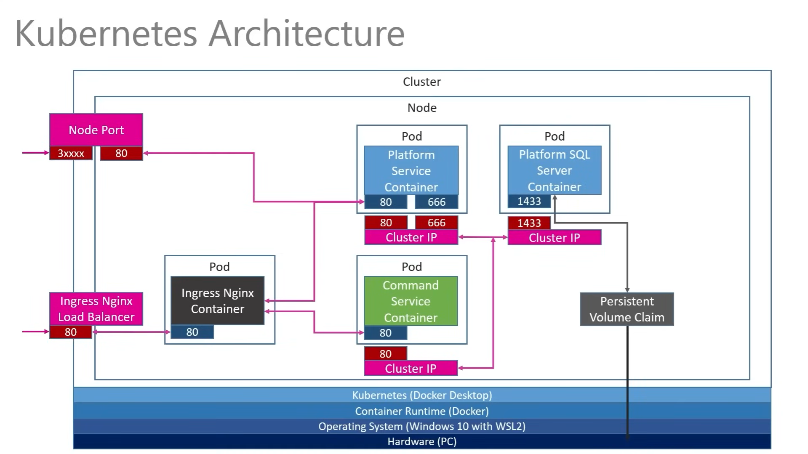
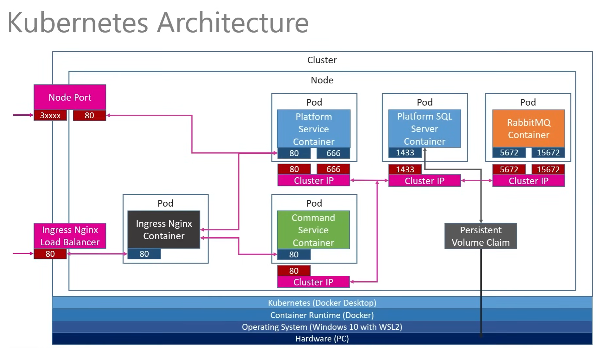

# K8S

Here's a step by step notes following along with the course to deploy the application to Kubernetes.

---

## Table of Contents

- [Deploying the Platform service to Kubernetes](#deploying-the-platform-service-to-kubernetes)
- [Creating the NodePort service](#creating-the-nodeport-service)
- [Creating the ClusterIP service](#creating-the-clusterip-service)
  - [Recap](#recap)
  - [ClusterIP service](#clusterip-service)
- [Setting up the API Gateway with Ingress Nginx Controller](#setting-up-the-api-gateway-with-ingress-nginx-controller)
  - [Installing the Ingress Nginx Controller](#installing-the-ingress-nginx-controller)
  - [Setting up the Ingress resource yaml file](#setting-up-the-ingress-resource-yaml-file)
  - [Applying the Ingress resource configuration](#applying-the-ingress-resource-configuration)
- [Setting up SQL Server in Kubernetes](#setting-up-sql-server-in-kubernetes)
  - [What is this Persistent Volume Claim?](#what-is-this-persistent-volume-claim)
  - [Setting up the Persistent Volume Claim](#setting-up-the-persistent-volume-claim)
  - [Setting up the Secret for the SQL Server](#setting-up-the-secret-for-the-sql-server)
  - [Setting up the SQL Server for the Platform service](#setting-up-the-sql-server-for-the-platform-service)
- [Deploying RabbitMQ to Kubernetes](#deploying-rabbitmq-to-kubernetes)
  - [Creating the RabbitMQ yaml file](#creating-the-rabbitmq-yaml-file)
  - [Checking if RabbitMQ is up and running](#checking-if-rabbitmq-is-up-and-running)
  - [Accessing the RabbitMQ Management UI](#accessing-the-rabbitmq-management-ui)

---

## Deploying the Platform service to Kubernetes

The first we are going to do is deploy a **Pod** with our Platform service to Kubernetes.



The first step is to create a deployment file ([platforms-depl.yaml](./platforms-depl.yaml)) with the following content:

```yaml
apiVersion: apps/v1
kind: Deployment
metadata:
  name: platforms-depl
spec:
  replicas: 1
  selector:
    matchLabels:
      app: platformservice
  template:
    metadata:
      labels:
        app: platformservice
    spec:
      containers:
        - name: platformservice
          image: <namespace>/platformservice:latest
```

Then we can create the deployment with the following command:

```bash
kubectl apply -f platforms-depl.yaml
```

And there we have it, the deployment is created, you can check it with the following command:

```bash
kubectl get deployments
```

And we can check the status of the pods with the following command:

```bash
kubectl get pods
```

---

## Creating the NodePort service

The next step is to create a **NodePort** service to expose the Platform service to the outside world, so we can access it from a Postman or any other HTTP client.



The first step is to create a service file ([platforms-np-srv.yaml](./platforms-np-srv.yaml)) with the following content:

```yaml
apiVersion: v1
kind: Service
metadata:
  name: platformnpservice-srv
spec:
  type: NodePort
  selector:
    app: platformservice
  ports:
    - name: platformservice
      protocol: TCP
      port: 8080
      targetPort: 8080
```

We are mapping the port 8080 from the NodePort service to the targetPort 8080 which is the port that the application is listening to.

Then we can create the service with the following command:

```bash
kubectl apply -f platforms-np-srv.yaml
```

And there we have it, the service is created, you can check it with the following command:

```bash
kubectl get services
```

In order to access the service from the outside world, we need to get the NodePort that was assigned to the service, we can do that with the following command:

```bash
kubectl describe service platformnpservice-srv
```

By now you should be able to access the service from the Postman or any other HTTP client.

---

## Creating the ClusterIP service

### Recap

In the previous section we created the HTTP Client to call the Command service, we've stablished the connection between the Platform and Command services, but it's still running/attached to the localhost.



_ps: skipping the docker build and push to the registry part, as it's already covered in the previous sections._

### ClusterIP service

In this section we are making this two services (Platform and Container) talk to each other via ClusterIP Services in Kubernetes.

So the endpoint that the Platform service is going to reach out to is the ClusterIP service attached to the Command service pod as shown below:



The first step is to create a service, to keep it simple we are going to create the ClusterIP service in the same file ([platforms-depl.yaml](./platforms-depl.yaml)) that we created the deployment.

Let's add the ClusterIP service to the file:

```yaml
---
apiVersion: v1
kind: Service
metadata:
  name: platforms-clusterip-srv
spec:
  type: ClusterIP
  selector:
    app: platformservice
  ports:
    - name: platformservice
      protocol: TCP
      port: 8080
      targetPort: 8080
```

Basically, the `name` defined in the `metadata` is the endpoint that the Platform service is going to call.

Then, we're going to create the ClusterIP service for the Command service as well.

You can check the file [commands-depl.yaml](./commands-depl.yaml) to see the ClusterIP service for the Command service, it's pretty much the same as the one we created for the Platform service.

After that, before we apply the files, we need to create a [`appsettings.Production.json`](../src/PlatformService/appsettings.Production.json) file to configure the Platform service to reach out to the Command service endpoint via the ClusterIP service.

```json
{
  "CommandService": "http://commands-clusterip-srv:8080/c/platforms"
}
```

As we changed the Platform service, we need to repackage the image and push it to the registry.

After that, we can apply the files:

```bash
kubectl apply -f platforms-depl.yaml
kubectl apply -f commands-depl.yaml
```

Just a reminder, as we already had a deployment for the Platform service, we need to refresh the deployment to apply the changes, we can do that with the following command:

```bash
kubectl rollout restart deployment platforms-depl
```

And that's it, the services are now talking to each other via ClusterIP services.

---

## Setting up the API Gateway with Ingress Nginx Controller

In a nutshell, an ingress controller is a reverse proxy for the Kubernetes universe. It acts as a reverse proxy, **routing traffic from the outside world to the correct service within a Kubernetes cluster**, and allows you to configure an HTTP or HTTPS load balancer for the said cluster.

But it doesn't accept numbers or localhost as a domain, so we need to set up a domain to access the services.

So, we are going to set up an Ingress Nginx Controller to route the traffic to our services as shown below, and then we can access the services via the domain we defined.



_we are only doing this because we are running on a local machine, in a production environment you would use a Load Balancer provided by your cloud provider and not an Ingress Controller._

### Installing the Ingress Nginx Controller

Looking up for "ingress nginx" on Google, we can find the official repository for the Ingress Nginx Controller for Kubernetes, which is [kubernetes/ingress-nginx](https://github.com/kubernetes/ingress-nginx).

Scrolling down a bit, we can find the section [Get started](https://github.com/kubernetes/ingress-nginx#get-started) that will lead us to the documentation on how to install the Ingress Nginx Controller, which is [here](https://kubernetes.github.io/ingress-nginx/deploy/).

#### Docker Desktop

If you are running on Docker Desktop, you can install the Ingress Nginx Controller with the following command:

```bash
kubectl apply -f https://raw.githubusercontent.com/kubernetes/ingress-nginx/controller-v1.12.0-beta.0/deploy/static/provider/cloud/deploy.yaml
```

#### MiniKube

If you are running on MiniKube, to install the Ingress Nginx Controller you only need to enable the Ingress addon with the following command:

```bash
minikube addons enable ingress
```

After that, we can check if the Ingress Nginx Controller is up and running with the following command:

```bash
kubectl get pods -n ingress-nginx
```

It should return something like this:

| NAME                                      | READY | STATUS    | RESTARTS | AGE |
| ----------------------------------------- | ----- | --------- | -------- | --- |
| ingress-nginx-admission-create-7z5zv      | 0/1   | Completed | 0        | 2m  |
| ingress-nginx-admission-patch-4z5zv       | 0/1   | Completed | 0        | 2m  |
| ingress-nginx-controller-5b4b4b4b4b-4z5zv | 1/1   | Running   | 0        | 2m  |

_ps: You can delete those idle pods if you want, they were created to run some jobs and they are not needed anymore._

The Ingress Nginx Controller is up and running, we can move on to the next step.

### Setting up the Ingress resource yaml file

Now, we need to create an **Ingress resource** to route the traffic to our services using their ClusterIP services. For that, we can create a file ([ingress-srv.yaml](./ingress-srv.yaml)).

As you can see, we defined the `host` as `acme.com`, which is a fake domain, you can change it to whatever you want, but remember to add it to your `hosts` file.

#### What is this `hosts` file?

The `hosts` file is a file that maps hostnames to IP addresses, it's used to resolve the domain names before DNS resolution. We need to add the domain we defined in the Ingress resource to the `hosts` file to access the services via the Ingress Nginx Controller.

##### Windows `hosts` file

On windows you can find the `hosts` file in the following path: `C:\Windows\System32\drivers\etc`.

You can add the following line to the `hosts` file:

```bash
127.0.0.1 <domain>
```

Changing the `<domain>` to whatever you defined in the Ingress resource, in this case, `acme.com`.

##### Linux `hosts` file

On linux you can find the `hosts` file in the following path: `/etc/hosts`.

This is a little bit tricky, because we are running on a local machine, so we need to get the IP of the minikube to add to the `hosts` file.

You can get the IP of the minikube with the following command:

```bash
minikube ip
```

And then you can add the following line to the `hosts` file:

```bash
<minikube_ip> <domain>
```

Changing the `<minikube_ip>` to the IP of the minikube and the `<domain>` to whatever you defined in the Ingress resource, in this case, `acme.com`.

### Applying the Ingress resource configuration

After that, we finally can apply the Ingress resource with the following command:

```bash
kubectl apply -f ingress-srv.yaml
```

And what we reached so far is that we can access the services via the Ingress Nginx Controller using the domain `acme.com`.

What this does is that the **Ingress Controller** is going to route the traffic to the services based on the path, acting as a reverse proxy, so if we access `acme.com/platforms` it's going to route the traffic to the Platform service, and if we access `acme.com/commands` it's going to route the traffic to the Command service.

External traffic passes thru the Load Balancer, then to the Ingress Controller, and finally to the services.

---

## Setting up SQL Server in Kubernetes

In this section we are going to set up a SQL Server in Kubernetes for our Platform service to store the data.



### What is this Persistent Volume Claim?

In a production environment, you would configure a **SQL Server** and a **Persistent Volume** to store the data. However, for this development scenario, we will use a local SQL Server and a **Persistent Volume Claim (PVC)** for storage on our local machine.

This is necessary because, when persisting data in a Pod, we need storage that isn’t ephemeral. A **Persistent Volume** provides storage that remains available regardless of the Pod's lifecycle. This way, if the Pod crashes or is restarted, the data is still safe and accessible.

### Setting up the Persistent Volume Claim

The first step is to create a Persistent Volume Claim (PVC) to store the data of the SQL Server.

You can check the file [local-pvc.yaml](./local-pvc.yaml) to see the PVC configuration.

After creating the PVC, we can apply it with the following command:

```bash
kubectl apply -f local-pvc.yaml
```

### Setting up the Secret for the SQL Server

When we set up the SQL Server, it will require a system administrator password, therefore we need to create a secret to store this password. So, we are going to create as a secret in kubernetes and pull that in via config file.

To do that, we are not going to create a file (it would defeat the purpose of the secret), we are going to use CLI and not store anywhere.

With that said, we can create the secret with the following command:

```bash
kubectl create secret generic mssql --from-literal=SA_PASSWORD=y0ur_pa55w0rd!
```

### Setting up the SQL Server for the Platform service

You can check the file [mssql-plat-depl.yaml](./mssql-plat-depl.yaml) to see the SQL Server configuration such as:

- The deployment for the SQL Server
- The environment variables for the SQL Server
- ClusterIP service for the communication between the Platform service and the SQL Server
- LoadBalancer service to access the SQL Server from the outside world

After creating the SQL Server, we can apply it with the following command:

```bash
kubectl apply -f mssql-plat-depl.yaml
```

Just to make sure the SQL Server is up and running, we can check the pods with the following command:

```bash
kubectl get pods
```

And that's it for the SQL Server setup.

## Deploying RabbitMQ to Kubernetes

In this section we are going to set up a RabbitMQ container with a ClusterIP and a LoadBalancer service to access it from the outside world. We need the LoadBalancer to allow our services to communicate with each other locally (via `dotnet run`) to do some testing.



_ps: this implementation is **not** recommended for production environments, we are setting RabbitMQ with 1 instance and no persistence, in a production environment you should follow the RabbitMQ documentation to set up a cluster with persistence as they recommend._

### Creating the RabbitMQ yaml file

Pretty much following the same boilerplate as the SQL Server, we are going to create a RabbitMQ deployment file ([rabbitmq-depl.yaml](./rabbitmq-depl.yaml)).

After creating the RabbitMQ deployment, we can apply it with the following command:

```bash
kubectl apply -f rabbitmq-depl.yaml
```

### Checking if RabbitMQ is up and running

After applying the RabbitMQ yaml file, we can check if the RabbitMQ is up and running with the following command:

```bash
kubectl get deployments
kubectl get pods
kubectl get services
```

You should see the RabbitMQ deployment, pod, and services up and running.

### Accessing the RabbitMQ Management UI

The RabbitMQ Management UI is a web-based application that allows you to monitor and interact with RabbitMQ.

The default username and password are `guest`.

#### Access on Windows

You can directly access the RabbitMQ Management UI by going to the following URL: `localhost:15672`.

#### Access on Linux

On Linux, you need to get the IP of the minikube to access the RabbitMQ Management UI.

You can get the IP of the minikube with the following command:

```bash
minikube ip
```

And then you can access the RabbitMQ Management UI by going to the following URL: `<minikube_ip>:15672`.

---
