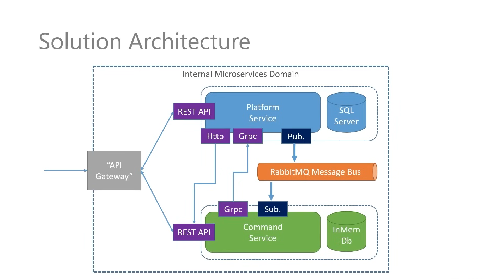
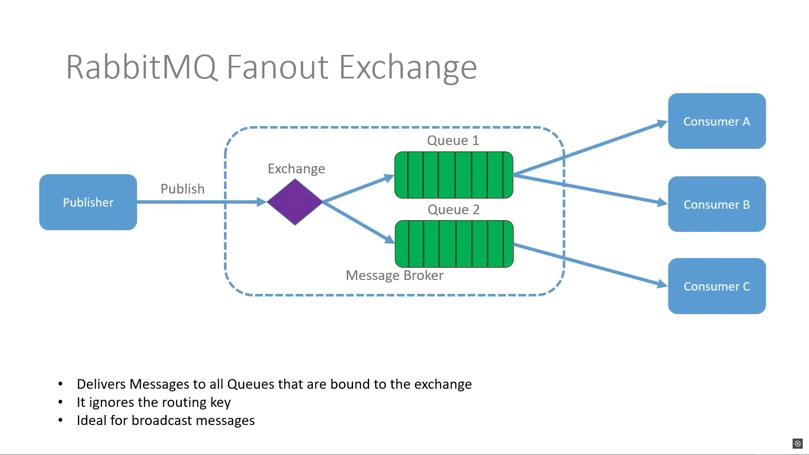

# Microservices

The simplest microservices application that you can build with .NET

## Introduction

This repository is [.NET Microservices – Full Course](https://youtu.be/DgVjEo3OGBI) from Les Jackson on Youtube

## About the project

Theme: **Command Service System**

The project involves developing a system that manages two main types of microservices:

- **Platform Service**: This service handles operations related to the platform, which can be considered part of the infrastructure or a database of information related to products, systems, or users.
- **Command Service**: This service manages specific actions or "commands" that can be executed based on requests made to the system.

_you can find more information about the services in their respective README files._

The goal of the course is to guide the student in building these two microservices and how they communicate, either synchronously (via **HTTP** or **gRPC**) or asynchronously (using an Event Bus with **RabbitMQ**).

### Architecture

- **Platform Service**: This microservice is a REST based API that manages the platforms that can be used to execute commands. It has its own SQL Server database to store the platforms.
- **Command Service**: This microservice is also a REST based API that manages the commands that can be executed on a specific platform. It has its own In-Memory database to store the commands.
- **API Gateway**: This service is the front door for all our services. It's responsible for routing the external requests to the correct service.
- **HTTP Client**: This is one approach to communicate between services. The **platform service** uses an HTTP client to communicate with the **command service**, as a new platform is created, it sends a POST request to the command service to know that a new platform has been created.
- **Message Bus**: This is another approach to communicate between services and this is what we are focusing the most in this project.

  The **platform service** publishes a message to the message bus when a new platform is created, and the **command service** listens to the message bus to know that a new platform has been created and then can proceed to add it to its own database.

  Services don't share the same database, but they do need to share the same information. This is where the message bus comes in. It's a way to communicate between services without having to share the same database.

- **gRPC**: We are using gRPC to allow our **command service** to reach out to the **platform service** and pull down the platforms that it doesn't already have.

  A point to note is that gRPC is synchronous, so we are coupling our services together. This is not a bad thing, but it's something to be aware of.

- **Docker**: We use Docker to containerize our services. This allows us to package each service along with its dependencies into portable, self-sufficient containers that can run consistently across different environments.

- **Kubernetes**: We use Kubernetes to orchestrate and manage our containerized services. Kubernetes enables automated deployment, scaling, and maintenance of containers, helping us closely replicate a production-like environment for testing and operation.

  Docker images are built for each service, and these images are deployed and managed within the Kubernetes cluster.

### Message Broker

We are using **RabbitMQ** as the message broker and the **Fanout** exchange type to communicate between the services.

This means that when a message is sent to the exchange, it will be broadcasted to all queues that are bound to that exchange, but in this case, we are only using one queue for each service.

Our publisher is the **Platform Service**, and as soon as a new platform is created it will publish a message to the exchange which is going to **fan out** to every queue that's bound to it (it doesn't matter in our case, it's only one queue).

And then any consumer that is listening to that queue will receive the message and process it, in our case, it's the **Command Service**.

---

## Requirements

- [.NET Core 5 or later](https://dotnet.microsoft.com/download)
- [Docker Desktop](https://www.docker.com/products/docker-desktop)
- [Account on Docker Hub](https://hub.docker.com/)
- [Insomnia](https://insomnia.rest/download) or [Postman](https://www.postman.com/downloads/)

---

## Testing

To keep it simple, we are going to test the application endpoints using http rather than https for the most part for various reasons, more especially when you come to kubernetes, it becomes very complex and it's going to detract from the main focus of the course.

---

## Docker guide

You can find a Docker guide in the [Docker.md](./docs/Docker.md) file that might be useful to help you get started and follow along with the course.

---

## Kubernetes guide

You can find a Kubernetes guide in the [Kubernetes.md](./docs/Kubernetes.md) file that might be useful to understand how it works and some basic commands to help you get started.

---

## Messaging

You can check the [Messaging.md](./docs/Messaging.md) file to understand how **asynchronous** and **synchronous** messaging works in the microservices architecture.

---

## gRPC

You can check the [gRPC.md](./docs/gRPC.md) file to understand how gRPC works and how to use it in the project.

---

## K8S Development process

You can check the [K8S README.md](./K8S/README.md) file to understand the development process of deploying the application to Kubernetes.
