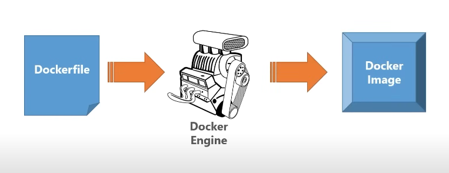

# Microservices

## Introduction

This repository is [.NET Microservices – Full Course](https://youtu.be/DgVjEo3OGBI) from Les Jackson on Youtube

## Testing

To keep it simples, we are going to test the application endpoints using http rather than https for the most part for various reasons, more especially when you come to kubernetes, it becomes very complex and it's going to detract from the main focus of the course.

## Containerization process overview

### How it works?

1. We need to create a `Dockerfile` which is a set of instructions that tells Docker how to take our application and turn it into a image.
   ps: The image is one of those things that you can distribute somewhere into anything that's running Docker.
2. Run the `dockerfile` through the docker engine to create an image.
3. We end up with an image that we can run in a container.

### Setting up the Dockerfile

Follow the [official microsoft tutorial](https://learn.microsoft.com/en-us/dotnet/core/docker/build-container?tabs=windows&pivots=dotnet-8-0) to create a `Dockerfile` for a .NET Core application.

## Docker cheat sheet

You can find a Docker cheat sheet in the [Docker.md](./docs/Docker.md) file that might be useful to help you get started with Docker and follow along with the course.
