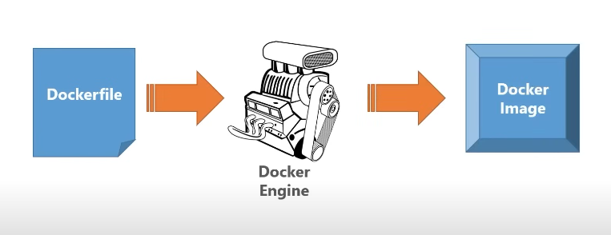

# Docker guide

Here are some quick guide to help you get started with Docker.

## Table of contents

- [What is Docker?](#what-is-docker)
- [Installation](#installation)
- [Containerization process](#containerization-process)
  - [How it works?](#how-it-works)
- [Dockerfile](#dockerfile)
  - [Setup a Dockerfile](#setup-a-dockerfile)
- [Commands](#commands)

---

## What is Docker?

Docker is a platform for developing, shipping, and running applications using containerization. It allows you to package your application and all its dependencies into a container, which can then be run on any machine that has Docker installed.

---

## Installation

### Windows

1. Download the [Docker Desktop for Windows](https://hub.docker.com/editions/community/docker-ce-desktop-windows) from the Docker Hub.
2. Install the Docker Desktop, pretty straightforward.
3. Enable WSL 2 (Windows Subsystem for Linux) by following the [official guide](https://docs.microsoft.com/en-us/windows/wsl/install).
   But it's pretty simple, just run the following command in PowerShell as an administrator:

   ```powershell
    wsl --install
   ```

4. Restart your computer and you are ready to go!

#### Troubleshooting

If you are having trouble with virtualization, you might need to enable it in the BIOS settings.

1. Restart your computer and enter the BIOS settings by pressing the appropriate key (usually F2, F10, or Del).
2. Look for an option called “Intel Virtualization Technology” (for Intel processors) or “SVM Mode” (for AMD processors) and enable it
3. Save the changes and restart your computer.
4. Enable Virtual Machine Platform on Windows
   4.1. Open PowerShell as an administrator

   4.2. Run the following command to enable Virtual Machine Platform:

   ```powershell
   dism.exe /online /enable-feature /featurename:VirtualMachinePlatform /all /norestart
   ```

   4.3. Then, enable the Windows Subsystem for Linux feature:

   ```powershell
   dism.exe /online /enable-feature /featurename:Microsoft-Windows-Subsystem-Linux /all /norestart
   ```

   4.4. Restart your computer.

5. You should be able to run Docker Desktop without any issues.

### Linux

This is a step-by-step guide to install Docker on Arch Linux. For other distributions, check the [official documentation](https://docs.docker.com/engine/install/) or some youtube tutorials.

1. Install [Docker](https://docs.docker.com/engine/install/)

   Required to create images and run containers.

   ```bash
     sudo pacman -S docker
   ```

2. Add your user to the `docker` group to avoid using `sudo` every time you run a Docker command.

   ```bash
    sudo usermod -aG docker $USER
   ```

3. Start and enable the Docker service.
   This will start the Docker service and enable it to start on boot so you don't have to start it manually every time you boot your computer.

   ```bash
    sudo systemctl start docker
    sudo systemctl enable docker
   ```

4. Verify that Docker is installed correctly by running the following command:

   ```bash
    docker --version
   ```

5. You are ready to go!

---

## Containerization process

Docker uses a technology called containerization to create and manage containers. A container is a lightweight, standalone, executable package of software that includes everything needed to run an application: code, runtime, system tools, system libraries, and settings.

### How it works?



1. We need to create a `Dockerfile` which is a set of instructions that tells Docker how to take our application and turn it into a image.
   ps: The image is one of those things that you can distribute somewhere into anything that's running Docker.
2. Run the `dockerfile` through the docker engine to create an image.
3. We end up with an image that we can run in a container.

---

## Dockerfile

A `Dockerfile` is a text document that contains all the commands a user could call on the command line to assemble an image. Using `docker build` users can create an automated build that executes several command-line instructions in succession.

### Setup a Dockerfile

Follow the [official microsoft tutorial](https://learn.microsoft.com/en-us/dotnet/core/docker/build-container?tabs=windows&pivots=dotnet-8-0) to create a `Dockerfile` for a .NET Core application.

---

## Commands

### Build an image

In the `dockerfile` directory, enter the following code:

```bash
docker build -t <your_docker_hub_id>/<image_name> .
```

ps: The `.` at the end of the command tells Docker to look for the `Dockerfile` in the current directory. Also, use lowercase for the image name.

### Run an image as a container

```bash
docker run -p 8080:8080 -d <your_docker_hub_id>/<image_name>
```

`-p` flag tells Docker to map port 8080 on the host (your machine) to port 8080 on the container.

`-d` flag tells Docker to run the container in the background.

ps: Every time you run an image, Docker creates a container from that image, it's not the same as restarting a container if you stop it. To restart a container, [see below](#restart-a-container).

### List all running containers

```bash
docker ps -a
```

`-a` flag tells Docker to list all containers, including the ones that are not running.

### Stop a running container

```bash
docker stop <container_id>
```

### Restart a container

```bash
docker start <container_id>
```

### Remove a container

```bash
docker rm <container_id>
```

### Remove an image

```bash
docker rmi <image_id>
```

### Push an image to Docker Hub

```bash
docker push <your_docker_hub_id>/<image_name>
```
