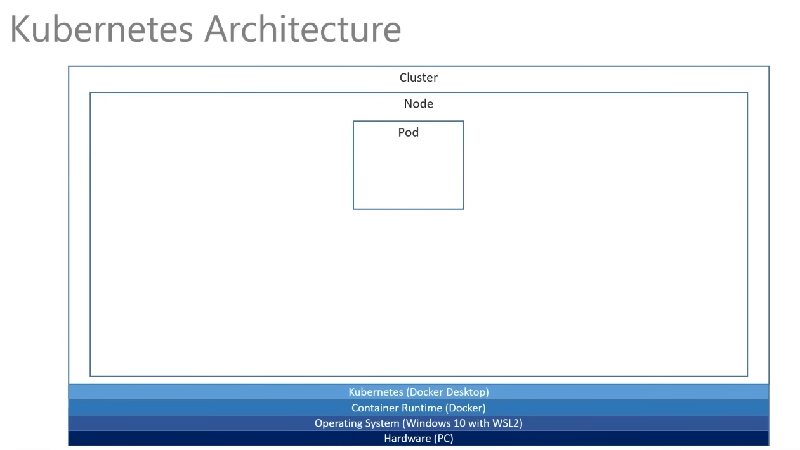

# Kubernetes

Here are some useful commands to help you get started with Kubernetes.

## Table of contents

- [What is Kubernetes?](#what-is-kubernetes)
  - [Architecture](#architecture)
  - [Deployment YAML file](#deployment-yaml-file)
- [Installation](#installation)
  - [Windows](#windows)
  - [Linux](#linux)
- [Getting started](#getting-started)
  - [Create a deployment](#create-a-deployment)
  - [Create a service](#create-a-service)
- [Commands](#commands)

---

## What is Kubernetes?

Kubernetes is an open-source container orchestration platform that automates the deployment, scaling, and management of containerized applications.

### Architecture

It is composed by multiple layers:

- **Cluster**: A cluster is a set of physical or virtual machines that are connected to each other and run Kubernetes.
- **Node**: A node is a physical or virtual machine that is part of a Kubernetes cluster.
- **Pod**: A pod is the smallest unit of deployment in Kubernetes. It is a group of one or more containers that share the same network and storage.



### Deployment YAML file

A deployment file is a YAML file that defines the deployment configuration. It contains the following fields:

- **apiVersion**: The version of the Kubernetes API that you are using.
- **kind**: The type of resource that you are creating.
- **metadata**: Contains information about the deployment, such as the name and labels.
- **spec**: Contains the deployment configuration, such as the number of replicas and the container image.
  - **replicas**: The number of replicas that you want to create (horizontal scaling).
  - **selector**: Basically, the labels that the deployment will use to select the pods.
  - **template**: Definition of what we want to deploy, the pod config and its containers.

---

## Installation

### Windows

1. Install [Docker Desktop](https://www.docker.com/products/docker-desktop)
2. Enable Kubernetes in Docker Desktop settings
3. Ready to go!

### Linux

1. Install [Docker](https://docs.docker.com/engine/install/)
   Required to create images and run containers.
   ps: Remember to add your user to the `docker` group to avoid using `sudo` every time you run a Docker command.

   ```bash
    sudo usermod -aG docker $USER
   ```

2. Install [kubectl](https://kubernetes.io/docs/tasks/tools/install-kubectl/)
   Required to interact with the Kubernetes cluster. This is the command-line tool that allows you to run commands against Kubernetes clusters.

3. Install [Minikube](https://minikube.sigs.k8s.io/docs/start/)
   Required to create a local Kubernetes cluster. This will allow you to test your deployments locally before deploying them to a production cluster.

4. Start Minikube

```bash
minikube start --driver=docker
```

`--driver=docker` is used to specify the container runtime to be used by Minikube. The default is `docker`, but you can also use `podman` or `containerd`.

---

## Getting started

### Create a deployment

1. Define a deployment file
   The deployment file is a YAML file that defines the deployment configuration.

2. Apply the deployment
   Applying the deployment will create a deployment in the Kubernetes cluster. To do this, in the same directory as the deployment file, run the following command:

   ```bash
   kubectl apply -f <deployment-file>.yaml
   ```

3. You should see the deployment created by running the following command:

   ```bash
   kubectl get deployments
   ```

### Create a service

1. Define a service file
   The service file is a YAML file that defines the service configuration.

2. Apply the service
   Applying the service will create a service in the Kubernetes cluster. To do this, in the same directory as the service file, run the following command:

   ```bash
   kubectl apply -f <service-file>.yaml
   ```

3. You should see the service created by running the following command:

   ```bash
   kubectl get services
   ```

4. Get the external IP of the service

   ```bash
   minikube service <service-name> --url
   ```

   This command will return the external IP of the service, which you can use to access the application.

   ps: If you are using Docker Desktop, you can skip this step and access the application at `localhost`, just use the port that the service is using.

5. Access the application
   Open a browser and navigate to the external IP of the service to access the application.

---

## Commands

### Cluster

- Get cluster information

```bash
kubectl cluster-info
```

- Get nodes

```bash
kubectl get nodes
```

- Get pods

```bash
kubectl get pods
```

### Deployment

- Create a deployment

```bash
kubectl create deployment <deployment-name> --image=<image-name>
```

- Get deployments

```bash
kubectl get deployments
```

- Get deployment details

```bash
kubectl describe deployment <deployment-name>
```

- Delete a deployment

```bash
kubectl delete deployment <deployment-name>
```

### Service

- Create a service

```bash
kubectl expose deployment <deployment-name> --type=LoadBalancer --port=<port>
```

- Get services

```bash
kubectl get services
```

- Get service details

```bash
kubectl describe service <service-name>
```

- Delete a service

```bash
kubectl delete service <service-name>
```

### Pod

- Get pods

```bash
kubectl get pods
```

- Get pod details

```bash
kubectl describe pod <pod-name>
```

- Delete a pod

```bash
kubectl delete pod <pod-name>
```
