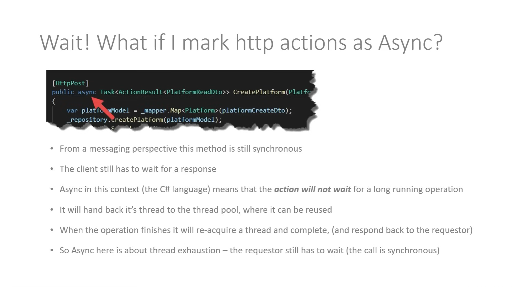
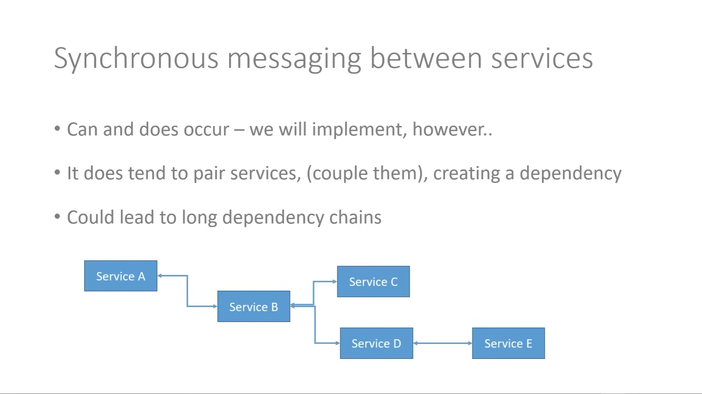
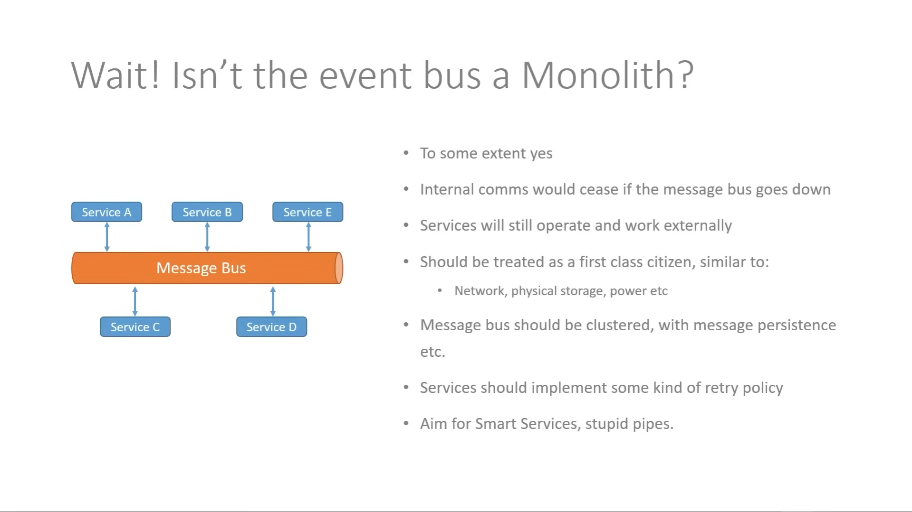

# Messaging

Here we are the explanation of **Synchronous** and **Asynchronous** messaging in the microservices architecture.

---

## Synchronous messaging

- **Request / Response Cycle**

  As a client, you send a request to a server and wait for a response.

- **Request will "wait" for a response**

  That means the client will be blocked until the server responds.

- **Externally facing services usually synchronous (e.g. http requests)**

  For example, when you make a request to a web application, or a REST API, you are using a synchronous request. When you're talking about service to service communication, you can use synchronous communication, but for the most part, it's asynchronous.

- **Services usually need to know about each other**

  The consumer needs to know where the server is, meaning the client needs to know the server's address, making it tightly coupled.

- **In this project we are using 2 forms of synchronous communication:**

  - HTTP
  - gRPC

---

## Asynchronous messaging

- **No Request / Response Cycle**

- **Requester does not wait for a response**

- **Event model, e.g. publish - subscribe**

- **Typically used between services**

- **Event bus is often used (e.g. RabbitMQ, Kafka)**

- **Services do not need to know about each other, just the bus**

  The idea is, as a requester, i just need to talk with the message bus and say _"Here you go, here's something others services need to know about... or here is some information i potentially need"_, and then the message bus will take care of the rest.

  Later on those other services will receive the message and then respond back onto the event bus in that kind of event-driven architecture.

- **Introduce its own range of complexities**

  It's not a silver bullet, it's not a one-size-fits-all solution. It introduces its own range of complexities, but it's a very powerful tool to have in your toolbox.

