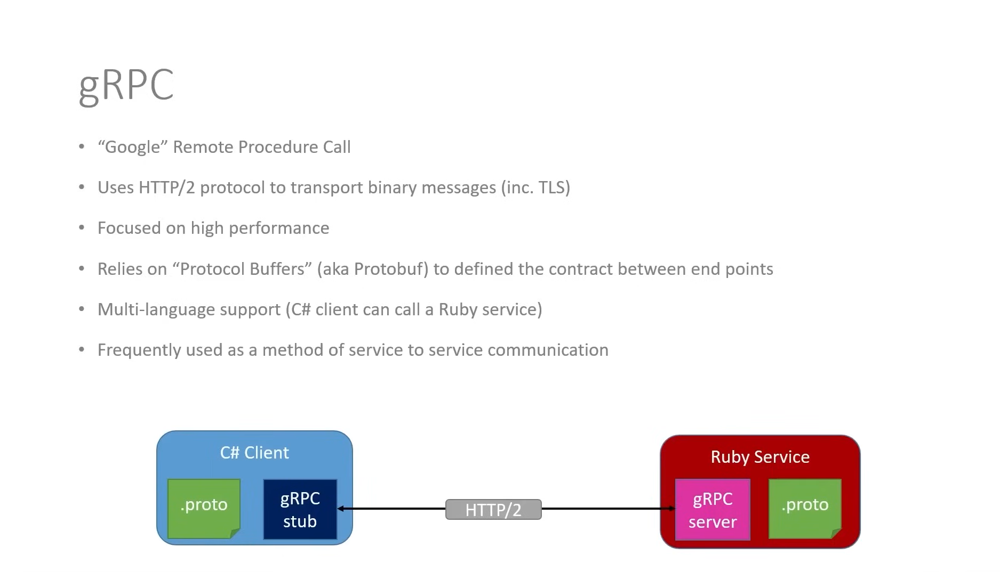

# gRPC

## What is gRPC?

Created by Google, gRPC is a high-performance, open-source and universal RPC (Remote Procedure Call) framework that can run in any environment. It enables client and server applications to communicate synchronously.

gRPC uses HTTP/2 for transport, that means it does require a secure connection (TLS) by default, in this project we are not using https, so we need to do some workarounds to make it work.

Mainly used for communication between microservices in a distributed system.

## How to use gRPC?

We basically define a Protocol Buffer file (.proto) that describes the structure of the messages (input / output) that are going to be exchanged between the client and the server.

The protobuf file needs to exist in both the client and the server, so that they can communicate with each other.

Then the gRPC library builds up a lot of stuff in the background that allows it to work, and then we work with gRPC to make calls and receive requests.
